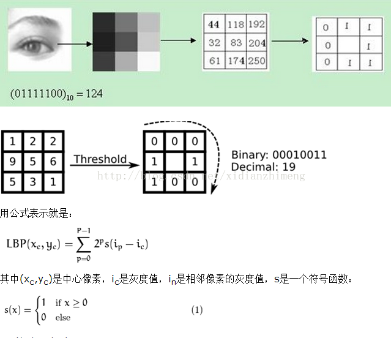
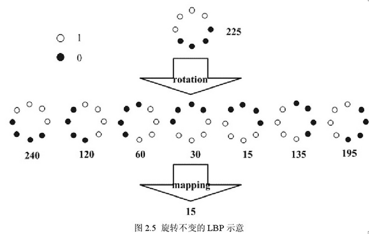
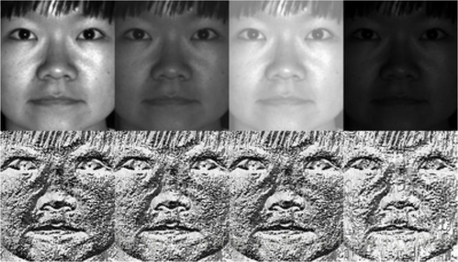

[TOC]

## 问题

LBP是一种常见的特征描述算法，用来提取局部的纹理特征，其原理其实很简单，下面我们就来看看它是怎么一回事吧。

## LBP简介

LBP（Local Binary Patterns，局部二值模式）是一种很简单但很高效的局部纹理特征描述算子，于1994年由T. Ojala, M. Pietikäinen和D. Harwood提出，经过后续的改进，LBP特征具有**旋转不变性**和**灰度不变性**，在机器视觉领域中得到了广泛的应用，如人脸识别、指纹识别、光学字符识别以及车牌识别等。

## LBP算子的优缺点

参考： https://blog.csdn.net/lk3030/article/details/84034963 

优点:

- 一定程度上消除了光照变化的问题
- 具有旋转不变性
- 纹理特征维度低，计算速度快

缺点:

- 当光照变化不均匀时,各像素间的大小关系被破坏,对应的LBP算子也就发生了变化。
- 通过引入旋转不变的定义,使LBP算子更具鲁棒性。但这也使得LBP算子丢失了方向信息。

## LBP特征描述原理

LBP是一种局部特征描述算子，最原始的LBP算子使用大小为3×3的窗口，将窗口中心邻域的8个像素分别与窗口中心像素其进行比较，邻域像素值大于中心像素值的位置标记为1，否则标记为0，从而得到一个8位的二进制值，将该值作为该窗口中心像素的LBP值（通常将8位的二进制值转换成十进制表示，即有256种可能的LBP值）。

如下图所示，可以更直观地理解LBP特征描述的思想（以窗口中心左上角的像素作为LBP值起始位）：

  

> LBP的原理的确很简单吧？简单归简单，这显然还不能完全满足我们实际应用的需求，比如窗口大小的调整、旋转不变性等等，于是就有了以下一些改进的版本。

## 圆形LBP算子

原始的LBP算子的一个**缺陷**在于它只覆盖了一个固定半径范围内的小区域，这显然不能满足不同尺寸和频率纹理的需要。为了**适应不同尺度的纹理特征，并达到灰度和旋转不变性**的要求，Ojala等对LBP算子做了以下改进：

1. 将3×3邻域扩展到任意邻域
2. 用圆形邻域代替了正方形邻域

改进后的LBP算子允许在半径为 R 的圆形邻域内有任意多个像素点，从而得到了诸如半径为R的圆形区域内含有P个采样点的LBP算子。下图给出三种不同半径大小的圆形LBP特征描述算子：

 

## 旋转不变LBP算子

从LBP的定义可以看出，LBP算子是灰度不变的，但却不是旋转不变的。图像的旋转就会得到不同的LBP值。Maenpaa等人又将LBP算子进行了扩展，提出了具有旋转不变性的局部二值模式算子，即**不断旋转圆形邻域得到一系列初始定义的LBP值，取其最小值作为该邻域的LBP值**。

如下图所示，对于以下8种不同旋转角度的LBP值特征，它们的LBP值均为15（即最小值，其二进制表示为00001111），因此图像的LBP特征就具有了旋转不变性。

    

## LBP等价模式

考察LBP算子的定义可知，一个**LBP**算子可以产生多种二进制模式（p个采样点）如：3x3邻域有p=8个采样点，则可得到**2^8=256**种二进制模式；5x5邻域有p=24个采样点，则可得到**2^24=16777216**种二进制模式，以此类推......。显然，过多的二进制模式无论对于纹理的提取还是纹理的识别、分类及信息存取都是不利的，在实际应用中不仅要求采用的算子尽量简单，同时也要考虑到计算速度、存储量大小等问题。因此需要对原始的**LBP**模式进行**降维**。 

为了解决上述二进制模式过多的问题，提高统计性，Ojala等人提出了采用一种**“等价模式”（Uniform Pattern）**来对LBP算子的模式种类进行降维。**其主要思想是**：对于某些代表了图像的边缘、斑点、角点等信息的LBP模式，其具有较好的特征区分度，我们不做降维，这些LBP模式归为**等价模式类**；而对于其他没什么代表性的LBP模式，我们不太关心，统一归为一种类型，叫做**剩余模式（混合模式）** 。

那么什么样的LBP模式具有较好的区分度，能够称为**等价模式**呢？Ojala等人认为，在实际图像中，绝大多数LBP模式**最多只包含两次从1到0或从0到1的跳变**。于是将等价模式定义为：**当某个LBP所对应的循环二进制数从0到1或从1到0最多有两次跳变时，该LBP所对应的二进制就称为一个等价模式类**。

> 例如如00000000（0次跳变），00000111（只含一次从0到1的跳变），10001111（先由1跳到0，再由0跳到1，共两次跳变）都是等价模式类。除等价模式类以外的模式都归为另一类，称为混合模式类，例如10010111（共四次跳变）
>
>  **判断**一个二进制模式是否为**等价模式**最简单**的办法**就是将LBP值与其循环移动一位后的值进行按位相与，计算得到的二进制数中1的个数，若个数小于或等于2，则是等价模式；否则，不是。 

通过这种改进，二进制模式的种类大大减少，而不会丢失任何信息，模式种类由原来的$2^{n}$减少为$n*(n-1)+2+1$种，这使得特征向量的维数更少，并且可以减少高频噪声带来的影响。 其中，n表示邻域集内的采样点数，共有$n*(n-1)+2$种**等价模式**和1种**剩余模式（混合模式）**。

> 等价模式种类的计算：由于等价模式中，所以为1的bit必须相邻，并且LBP模式是循环的（也就是收尾相连）。以n=8为例，
>
> 当有1个1时，有n种等价模式；（分别是10000000, 01000000, 00100000, ... , 00000001）
>
> 当有2个1时，有n种等价模式；（注意LBP是循环的，两个相邻的1移动到末尾后还可以再移动一次变成10000001）
>
> ...
>
> 当有n-1个1时，有n种等价模式；
>
> 另外再加上全0和全1这两种特殊的等价模式，共有(n-1)*n+2种等价模式，再加上其他统一归为一类的混合模式，所以降维后一共有(n-1)*n+3种LBP模式。

## LBP算子对均匀光照变化的鲁棒性

使用LBP算子提取特征，对于图像上的每个像素点都可以得到一个LBP值，这些LBP值也组成了一幅“图像”，如下图所示，上面为不同光照强度下的图像，下面为提取LBP特征后LBP值表示的图像，可以看出，**LBP特征提取对均匀的光照变化具有很强的鲁棒性**，因此这种算法在很多领域都得到了应用。

  

## LBP特征检测步骤

1. 将检测图像切分为若干个区块（cell，例如每个区块16x16像素）。

2. 对于每个cell中的一个像素，将相邻的8个像素的灰度值与其进行比较，若周围像素值大于中心像素值，则该像素点的位置被标记为1，否则为0。这样，3*3邻域内的8个点经比较可产生8位二进制数，即得到该窗口中心像素点的LBP值。
3. 然后计算每个cell的直方图，即每个LBP值出现的频率，然后对该直方图进行归一化处理（）。
4. 最后将得到的每个cell的统计直方图进行连接成为一个特征向量，也就是整幅图的LBP纹理特征向量。

然后就可以将该特征向量通过诸如SVM等机器学习算法来产生一个分类器进行分类任务了。

> 补充：
>
> 假设一幅图像为128×128大小，可以将图像划分为8×8=64个cell，每个cell包含16×16=256个像素，然后对每个cell中的每个像素计算一个LBP值，即每个cell得到16×16个LBP值，接着对每个cell分别统计直方图并归一化，将所有cell直方图的结果连接起来就组成了整幅图像的特征向量。
>
> 图像直方图归一化（Histogram Normalization）：指的是 有些灰度图像的像素并没有分布在 [0,255] 内，而是分布在 [0,255] 的子区间内。这样的图像肉眼看上去往往不是很清晰。我们可以通过直方图归一化的方式，将它的像素分布从 [0,255] 的子区间变为 [0,255] 范围内。通过这样的方式，往往可以增加图像的清晰度。这种归一化直方图的操作被称为灰度变换（Grayscale Transformation）。像素点的取值范围从 [c,d] 转换到 [a,b] 的算法如下： 
>
>    

## 参考资料

- [LBP原理加源码解析](https://blog.csdn.net/xidianzhimeng/article/details/19634573) https://blog.csdn.net/xidianzhimeng/article/details/19634573
- [Local Binary Patterns](http://www.scholarpedia.org/article/Local_Binary_Patterns) http://www.scholarpedia.org/article/Local_Binary_Patterns
- [lbp特征提取（等价模式）](https://www.cnblogs.com/xqy1205/p/7729572.html)
- [图像直方图归一化 Histogram Normalization](https://www.cnblogs.com/wojianxin/p/12509686.html)